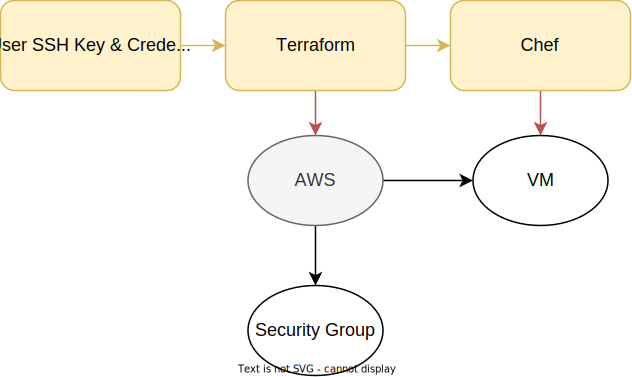

# CS312 Final Project
Set up a Minecraft Server on AWS using Terraform and Chef

## Background
This repository uses Terraform and Chef to set up a Minecraft server on AWS. The Terraform script creates an EC2 instance, configures the security group rules, and installs Chef on the VM. The Chef script installs Java, Minecraft, and sets up the server.

## Requirements
If you are on Debian or Ubuntu, you can run the following commands to install the required tools:
```
sudo apt-get update
sudo apt-get install -y terraform awscli
```

You also need to have an AWS account and have your credentials configured. You can find instructions on how to do that [here](https://docs.aws.amazon.com/cli/latest/userguide/cli-chap-configure.html).
Terraform assumes that the credentials are in the default location (~/.aws/credentials) although you can use environment variables to specify the location as well.

Finally, you need to generate an ssh key pair. You can do that with the following command:
```
ssh-keygen -t rsa -b 4096 -f ~/.ssh/id_rsa
```

Everything else is set up to configure the server for you automatically.


## Diagram
Below you can see the diagram of the pipeline. Since everything is handled by Terraform and Chef, there are only two steps requiring user input: Installing the required tools and configuring the AWS credentials. The rest of the steps are handled by Terraform and Chef.


## How to run
First, clone the repository:
```
git clone git@github.com:EMH333/CS312-final-project.git
```

Then, navigate to the directory:
```
cd CS312-final-project
```

Next, initialize Terraform:
```
terraform init
```

Finally, run the Terraform script:
```
terraform apply
```

You will be prompted to enter 'yes' so Terraform knows it is okay to proceed. After that, Terraform will create the EC2 instance and run the Chef script to install Minecraft. Once the script is finished, you can connect to the server using the public IP address of the EC2 instance. You can find the public IP address in the AWS console or by running the following command:
```
terraform output
```
